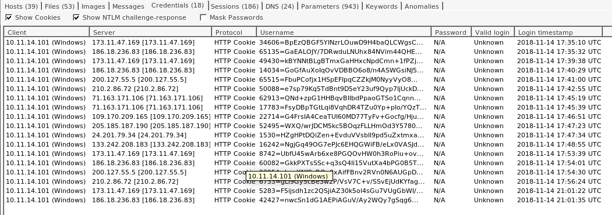

# [CA] Trojan Bancking (Network Forensics)

## Author

- **Name**: Steve Djumo Kouekam
- **Matricule**: ICT 2022 27 55
- **Email**: djumokouekam.steve@ictuniversity.edu.cm
- **Program**: Computer Science --  ICT University (Spring 2023)

## Questions

### Step 1: Seting up the tools for investigation

Ater donwloading `2018-11-14-Emotet-infection-with-IcedID-banking-Trojan.pcap` and `Network Miner for linux`, we lauch the tool and open the said `.pcap` file.

### Step 2: Finding the Anomalies in the traffic

First and foremost, after ordering the **host by traffic amount**, it appear that the source PC had the most packets exchange with **10.11.14.101**, **185.129.49.19**, and **160.36.66.221** respectively. Since **10.11.14.101** account for twice the traffic of the second and third host combine, it is a good starting point to know what going on.

Furthermore, while investigating the exchange during the attack, the notice 2 uncommon file type: `.doc` and `.exe`. Normally, the traffic should be mostly made of `.htm` and `.cert` file. Thus, we investigate furhter the document and executable received

Since the document file was download before (17:30:27) the executable (17:30:50) of the same, we investigate that angle first.

Looking at the document details, we can extract the **SHA256** signature to analyze on the **VirusTotal**.

Upon analysis by **VirusTotal**, it become clear that the document `form-363439590633444.doc` is a trojan that execute `VBA` to possibly open the door to other more dangerous/malicious program (according to definition of trojan program).

The details section confirm even more our basic analysis.

For details information on the how, the analysis with *Wireshark* of the initial **GET request** from **10.11.14.101** to server **78.135.65.15** is as follow.

We see that the PC make a *GET Request* as such `GET /En_us/Documents/11_18/ HTTP/1.1\r\n` with a Mozilla browser engine. Below, Wireshark indicate that the **response is in frame 71**. Following the rabbit hole, we see that the server reply back with a **application/msword** file type named **Content-Disposition: attachment; filename="form-363439590633444.doc"\r\n**

After inspection of the relation tab (VirtusTotal), we notice that the document contacted a few host. Moreover, Wireshark support that conjecture. **10.11.14.101** made a *DNS* query to acquire the IP address of **c-t.com.au**, which was resolved to **50.62.194.30**. Then a few traffic down the line, **10.11.14.101** made 2 request to **50.62.194.30**. Precisely a *GET Request* as follow **GET /PspAMbuSd2 HTTP/1.1** and  **GET /PspAMbuSd2/ HTTP/1.1** , since the first one redirect to the second one.

The second *Get Request* on the other hand, fetch something that will only appear at **frame 588**

The response of the previous *GET Request* give a file under the name of **Content-Disposition: attachment; filename="ijccaFkQnS.exe"\r\n**

As you can remember, we saw that filename previously in **NetworkMiner**. Going back in it, we extract his SHA_256 signature **(d6dd56e7fb1cc71fc37199b60461e657726c3bf8319ce59177ab4be6ed3b9fb4)** and anlysis it on *VirusTotal*. **64/70** score clearly indicate that it is a threat labeled **trojan.emotet/autoruns**.

Furthermore, the relation tab indicate to us many address the program want to connect. Particularly, **50.78.167.65** appear to be the first address contacted before the others (according to Wireshark). Surely, that server was a **Command & Control Center** that delivered the others address to contact.

As we can see below, after the initial contact with the server, many connection to various IP address are made.

Returning to *NetworkMiner*, a investigation of the **Credential Tab**, indicate that data are sent using **cookies**.

Continuing the investigation, since **Hybrid Analysis** didn't land us worth while results, we were lucky on **Packet Total instead**. It appear our host made many crypted conversation with **185.129.49.19**.  Furthermore, after the **Suspicious Activity** tab, we notice that the **SSL Certification to 185.129.49.19 failed !** Now the picture is clear, the certificated provided is not registered in list of trusted certificate. Thus, we can assume that host the master attack who is sending instruction the target to gain an authorized access to the network.

